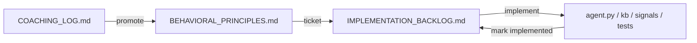

# Alex Implementation Backlog

Translates [BEHAVIORAL_PRINCIPLES.md](BEHAVIORAL_PRINCIPLES.md) into code, prompt, knowledge, and tests. Cursor owns architecture lane; Paul + ChatGPT own sales behavior lane.

| Priority | Principle | Proposed Change | File(s) | Owner | Status |
|----------|-----------|-----------------|---------|-------|--------|
| P0 | All principles | Add coaching loop docs (log, principles, backlog) | `docs/COACHING_LOG.md`, `docs/BEHAVIORAL_PRINCIPLES.md`, `docs/IMPLEMENTATION_BACKLOG.md` | Cursor | implemented |
| P0 | Savings-centric + incentive nudge | Add `# Sales behavior` section to system prompt | `agent-py/src/agent.py` | Cursor | implemented |
| P0 | Internal tiers private | Ban spoken tier/size language in prompt; rewrite enterprise/whale offer kb + spoken Michael example | `agent.py`, `knowledge.json`, `AGENT_SCRIPT.md` | Cursor | implemented |
| P0 | Behavioral anchors | Add `kb-behavior-*` entries (6) | `knowledge.json` | Cursor | implemented |
| P1 | Early soft meeting | Expand positive-curiosity phrases (onboarding, security, pricing, customers) | `call_signals.py` | Cursor | implemented |
| P1 | Weak agreement | Add `fine`; align coaching hints with principles | `call_signals.py` | Cursor | implemented |
| P1 | Scheduling recovery | Align rebuild hint with principles; document 3-cycle rule in prompt | `agent.py`, `call_signals.py` | Cursor | implemented |
| P1 | Conversational persistence | Two-strike talk-over + floor reclaim | `agent.py`, `call_signals.py`, `knowledge.json` | Cursor | implemented |
| P1 | AGENT_SCRIPT sync | Add Behavioral Principles section; fix offer scripts | `docs/AGENT_SCRIPT.md` | Cursor | implemented |
| P1 | Tests | Expand `test_call_signals.py`; add `test_behavior_knowledge.py` | `agent-py/tests/` | Cursor | implemented |
| P2 | Opening tease | Opening says "I have an offer" before Q&A — confirm this matches savings-first positioning | `agent.py`, `knowledge.json` | Paul | implemented |
| P1 | Opener (short and conversational) | Update `_opening_for()`, OPEN step, kb-uc1/2-opening, AGENT_SCRIPT.md | `agent.py`, `knowledge.json`, `docs/` | Cursor | implemented |
| P1 | Direct answering | Add `# Answering questions` section + `kb-behavior-direct-answering` | `agent.py`, `knowledge.json` | Cursor | implemented |
| P1 | Call-start latency | Investigate startup timing, LiveKit connect, VAD thresholds, turn detection, initial greeting trigger; prewarm Moss indexes + phase timing logs | `agent.py` | Cursor | implemented |
| P1 | Conversation drop-off | Investigate response streaming, turn detection, interruption handling, session lifecycle, timeout config, worker stability | `agent.py` | Cursor | open |
| P1 | Wolf persistence | OBJECTION_RECOVERY_HINT, wolf prompt, kb-behavior-wolf-persistence, kb-obj-not-interested | `call_signals.py`, `agent.py`, `knowledge.json` | Cursor | implemented |
| P1 | DNC exit | DNC_EXIT_HINT, DNC-only declined, kb-behavior-dnc-exit, declined hangup + no retry | `call_signals.py`, `agent.py`, `backend/src/calls.py` | Cursor | implemented |
| P1 | Talk-over yield | TALKOVER hints, `speech_created` callback, kb-behavior-talkover-yield | `call_signals.py`, `agent.py`, `knowledge.json` | Cursor | implemented |
| P1 | Active listening ad-libs | Prompt + kb-behavior-active-listening phrase bank | `agent.py`, `knowledge.json` | Cursor | implemented |
| P1 | Canonical opener | Fixed pump.co opener via `_spoken_opening`; update kb + docs | `agent.py`, `knowledge.json`, `docs/` | Cursor | implemented |
| P1 | Four-sentence cap | Hard 4-sentence max; last sentence must be a question | `agent.py`, `knowledge.json` | Cursor | implemented |
| P2 | Rebuild cycle counter | Runtime counter for 3 full rebuild+schedule cycles (today: prompt-only) | `agent.py` | Cursor | open |
| P2 | LLM-judged behavior evals | Judge tests for wolf persistence, talk-over rules, incentive-as-nudge | `test_agent.py` | Cursor | implemented |
| P2 | Training export sync | Regenerate export corpus after wolf/talk-over kb changes | `agent-py/export/` | Cursor | implemented |
| P1 | Estimate-aware UC2 qualify | UC-specific qualify in prompt; rewrite `kb-flow-uc2-qualify`; no spend re-ask on UC2 | `agent.py`, `knowledge.json`, `AGENT_SCRIPT.md` | Cursor | implemented |
| P1 | Lead context enrichment | Internal spend vs spoken savings in `moss_index.build_lead_document` + `leads.json` | `backend/src/moss_index.py`, `leads.json` | Cursor | implemented |
| P1 | Direct-answer + demo bridge | Update why-calling example; same-turn bridge rule; `kb-behavior-direct-answering` + new kb entries | `agent.py`, `knowledge.json`, `BEHAVIORAL_PRINCIPLES.md` | Cursor | implemented |
| P1 | Estimate-aware tests | KB guardrails + LLM-judged evals for no spend re-ask, demo bridge, same-turn product Q | `test_behavior_knowledge.py`, `test_agent.py` | Cursor | implemented |
| P1 | AI identity philosophy | Expand `# AI identity philosophy` in prompt; `kb-behavior-ai-identity-philosophy`; update `kb-obj-is-ai` / `kb-obj-is-this-ai`; docs + export + tests | `agent.py`, `knowledge.json`, `docs/`, `export/` | Cursor | implemented |
| P1 | Meeting value selling | `# Meeting value selling` prompt; MEETING_VALUE_HINT in call_signals; `kb-behavior-meeting-value-selling`; rewrite `kb-obj-send-email`; docs + export + tests | `agent.py`, `call_signals.py`, `knowledge.json`, `docs/`, `export/` | Cursor | implemented |
| P1 | Educate before re-ask + interest threshold | Interest ledger in call_signals; cold/warming/ready gates; `kb-behavior-educate-before-reask` + `kb-behavior-interest-threshold`; refine meeting-value kb | `agent.py`, `call_signals.py`, `knowledge.json`, `docs/`, `export/` | Cursor | implemented |

---

## Workflow

1. **Observe** — row in COACHING_LOG (`observed`)
2. **Promote** — Paul + ChatGPT add/update BEHAVIORAL_PRINCIPLES (`promoted`)
3. **Ticket** — row in IMPLEMENTATION_BACKLOG (`open`)
4. **Implement** — Cursor lands changes (`implemented`)
5. **Re-index** — `pnpm moss:index` after `knowledge.json` edits

---

## Questions requiring human sales judgment

| # | Question | Default until decided |
|---|----------|----------------------|
| 1 | Should opening line drop "I have an offer for you" and lead with savings/estimate only? | **Decided:** yes — opener includes UC2 savings + soft questions invite; no offer/incentive in opener |
| 2 | Mac Mini + senior AE loop-in — speak about senior team without referencing spend tier? | "I'll make sure the right person from our team joins the demo" |
| 3 | Disqualify scripts use "at that spend level" — acceptable because it's exit not flattery? | Yes, keep for not-qualified exits |
