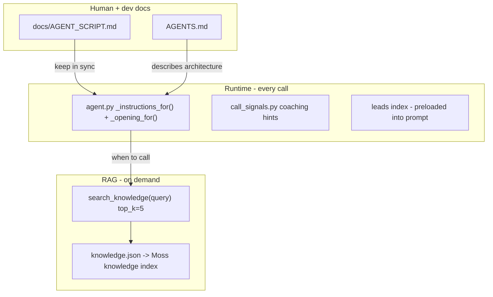

# Alex Instructions Critique

> Export for review with Chad (and for iterating on Alex's behavior).  
> Covers [agent-py/AGENTS.md](../agent-py/AGENTS.md), [agent-py/knowledge.json](../agent-py/knowledge.json), and how they relate to [agent-py/src/agent.py](../agent-py/src/agent.py).

**Status:** P0–P2 items from the critique plan are implemented. P3 polish items remain optional.

---

## The core mental model

Alex's instructions are **not one file**. They are three layers that must stay aligned but serve different jobs:



| Layer | Role | Change triggers |
|-------|------|-----------------|
| **System prompt** (`agent.py`) | Control plane: phase order, tool rules, voicemail, guardrails, outcomes | Redeploy agent worker; run evals |
| **knowledge.json** | Content plane: product facts, scripts, objections, phase wording | Edit JSON → `pnpm moss:index` |
| **leads.json** | Per-lead facts (name, spend, savings, similar-company proof) | Edit JSON → `pnpm moss:index` |
| **AGENT_SCRIPT.md** | Human-readable canonical script | Manual sync with `agent.py` |
| **AGENTS.md** | Guide for coding agents in this repo | No runtime effect |

**Design principle:** Don't duplicate the full call flow in both the system prompt and knowledge.json. The prompt owns *when* and *how*; knowledge owns *what to say*.

---

## AGENTS.md critique

### What was wrong (before)

AGENTS.md was mostly a **LiveKit starter template** with a **stale Moss section** describing a generic memory agent:

| Doc said | Code actually does |
|----------|-------------------|
| `memory` index + `MOSS_MEMORY_INDEX_NAME` | `leads` index + `MOSS_LEADS_INDEX_NAME` |
| `remember_fact` / `recall_facts` with `user_id` | `get_lead_context` with `lead_id` |
| 3 tools | 4 tools: `get_lead_context`, `search_knowledge`, `book_meeting`, `log_outcome` |
| Seeds memory from `knowledge.json` | Seeds leads from `leads.json` |

Anyone following the old doc would edit the wrong tools and wrong index.

### What was missing

~70% of project-specific architecture:

- Alex persona, UC1 vs UC2 hooks
- Dispatch metadata: `{ lead_id, use_case, phone_number? }`
- Backend hub (`BACKEND_URL/calls/outcome`) — agent does not touch Supabase directly
- Outbound SIP + voicemail = silent `no_answer`
- `call_signals.py` runtime coaching injection
- `transcript_store.py` persistence
- 8-outcome disposition framework (`docs/LEAD_DISPOSITIONS.md`)
- Instruction sync contract with `docs/AGENT_SCRIPT.md`
- Testing map (`test_moss`, `test_call_signals`, `test_agent`)

### What we fixed

AGENTS.md is now organized around Alex:

1. What this agent does (UC1/UC2, SIP)
2. Project structure + supporting modules
3. Moss indexes + data files
4. Tools + backend side effects
5. System prompt & script sync
6. Call signals & transcripts
7. Testing + env vars
8. Short LiveKit reference (boilerplate trimmed)

### Open questions for Chad

1. **Should AGENTS.md also link to this critique doc** as the "why" behind the split, or keep AGENTS.md purely operational?
2. **Handoffs/workflows** — LiveKit supports multi-agent workflows; Alex doesn't use them today. Worth adding a "future" note, or YAGNI until we need a second agent?
3. **Who owns script changes?** Today: `AGENT_SCRIPT.md` ↔ `agent.py` is manual. Do we want a CI check or a single source of truth?

---

## knowledge.json critique

### Consolidation (109 → 58 entries, latency pass)

Behavior rules (`kb-behavior-*`), phase anchors (`kb-anchor-*`), outcomes, exits, telephony, and spoken examples were removed from the Moss index. They duplicated `agent.py` / `call_signals.py` and forced redundant `search_knowledge` round-trips. The corpus now holds product facts, objections, offers, qualification, and trimmed flow scripts (UC qualify, booking progression, openers). Re-index after edits: `pnpm moss:index`.

### What was working (52 entries → now 84)

- Product overview, four products, pricing, savings, providers, permissions, safety
- Objection library (MSP, RIs, Cost Explorer, email, contract, timing, AI disclosure, scam, etc.)
- UC1/UC2 openings, qualify flows, tier offers (10 variants), booking rounds 1–4
- Behavioral addenda: weak agreement, offer-as-closing-aid, rejected-times rebuild, booking-interest threshold
- Demo spoken examples: Alex (SMB UC2), Michael (Whale UC2), Sam (UC1 disqualified)

### Critical bug we fixed: EDP contradiction

Two entries used to fight each other:

| Entry | Said |
|-------|------|
| `kb-obj-edp-ppa` | "Yes — transfer EDP to Pump billing, discounts stack" |
| `kb-exit-not-eligible-edp` | "Active EDP/credits → disqualify now" |

**Sales flow rule** (agent.py + AGENT_SCRIPT): during the **eligibility gate**, active EDP/credits = disqualify today. The "yes you can" answer is a **product FAQ** for a different moment ("how does Pump work with EDP long-term?").

**Fix applied:**
- `kb-obj-edp-ppa` → `topic: edp-product-faq` (objection phase)
- New `kb-edp-qualification-gate` → disqualify during qualify

**Reason with Chad:** If a prospect asks "we have an EDP, can Pump still help?" during Q&A, Alex should use the FAQ entry. If Alex is running the eligibility question ("are you on an EDP right now?") and they say yes, Alex should disqualify — not explain transfer.

### Gaps we filled (P1)

| Category | New entries |
|----------|-------------|
| **Outcomes (8)** | `kb-outcome-booked` through `kb-outcome-reengage-90d` |
| **Telephony** | `kb-telephony-voicemail`, `kb-telephony-gatekeeper` |
| **Phase anchors** | `kb-anchor-qualify-spend`, `interest-building`, `offer-closing-aid`, `rejected-meeting-times`, `booking-round-one`, `not-qualified-exit` |
| **Qualification** | `kb-tier-bands`, `kb-qual-already-customer`, `kb-qual-no-aws-gcp` |
| **Bridge** | `kb-bridge-offer-rejected` |
| **QA** | `kb-obj-how-much-cost`, `kb-product-month-to-month` |

### UC1 social proof math

- `leads.json` stores `similar_savings` as **monthly** (e.g. `$9,800`)
- UC1 qualify hook should speak **annual** (`× 12`)
- Fixed in `kb-flow-uc1-qualify` and UC1 lead doc text

**Reason with Chad:** Sarah/UC2 leads have `savings_estimate` monthly — agent prompt already says annualize for UC2 hooks (`× 12`). UC1 uses `similar_savings` the same way. Worth confirming with real lead data from Supabase that backend never sends pre-annualized numbers.

### Still optional (P3 — not done)

| Item | Why it might matter |
|------|---------------------|
| UC1 **qualified** spoken example (offer + book) | Rehearsal / finetuning corpus |
| More tier spoken examples (Core, Mid-Market, Enterprise) | Demo variety beyond Alex/Michael/Sam |
| EDP/credits **exit** spoken example | Train graceful disqualify tone |
| Interested/callback close without booking | Common real-world outcome |
| Normalize `phase: objection` on **all** objection entries | Cleaner RAG metadata; some still use `phase: qualify` intentionally |
| Voicemail spoken example | N/A — behavior is **non-speech**; telephony kb entry covers it |

### Metadata taxonomy (for RAG tuning)

Current conventions:

```text
category: product | objection | flow | offer | exit | qualification | outcome | telephony | bridge | spoken-example
phase:     open | qualify | offer | book | close | exit | objection | qa
use_case:  uc1_new_signup | uc2_estimate_completed  (when UC-specific)
```

**Resolved:** Anchor entries were collapsed into flow scripts (e.g. `kb-flow-booking-progression`). Behavior anchors are no longer in the index — the prompt owns control rules; RAG owns speakable scripts only.

---

## agent.py system prompt (the third file)

Not in AGENTS.md or knowledge.json, but **the strongest layer**. Key rules only in the prompt today:

- Voicemail: no speech, `log_outcome("no_answer")`, auto hangup
- Phase order: OPEN → Q&A → QUALIFY (spend, then EDP/credits) → BUILD INTEREST → OFFER → BOOK → CLOSE
- When to call `search_knowledge` (every Pump question + phase transitions)
- Output rules: plain text, at most four sentences (prefer one to two), spell out numbers, no tool names
- Prefer `interested` over `declined` when unsure

**Reason with Chad:** How much should move from prompt → knowledge?

| Keep in prompt | Move to knowledge |
|----------------|-------------------|
| Tool call timing, hangup rules | Offer scripts, objection lines |
| Voicemail detection | Product facts |
| Outcome enum validation | Example disposition notes |
| "Prefer interested over declined" | Tier-specific gift wording |

Leaning too much on knowledge risks the LLM not retrieving before speaking. Leaning too much on prompt means redeploy for every script tweak.

---

## Where to change what

| You want to change… | Edit first | Also |
|---------------------|------------|------|
| Call phase order, voicemail, tool rules | `agent.py` `_instructions_for()` | `docs/AGENT_SCRIPT.md`, tests |
| Product facts, objection lines, offers | `knowledge.json` | `pnpm moss:index` |
| Booking signal phrases | `call_signals.py` | `test_call_signals.py`, optionally kb |
| Demo lead data | `leads.json` | `pnpm moss:index` |
| Contributor onboarding | `AGENTS.md` | — |

---

## Health check (after any instruction change)

```bash
pnpm moss:index                                    # after knowledge.json or leads.json
uv --directory agent-py run pytest tests/test_moss.py tests/test_call_signals.py
uv --directory agent-py run src/agent.py console   # default lead: lead-uc2-sarah
```

**Spot checks:**
- Qualify phase + "yes we have an EDP" → disqualify, don't explain transfer
- Voicemail cues → silent `no_answer`, no pitch
- Weak agreement ("sure", "okay") → reinforce value before booking

---

## Summary for Chad conversation

1. **We had doc drift** — AGENTS.md described a memory agent that doesn't exist; fixed.
2. **Instructions are intentionally split** — prompt = control, knowledge = content, leads = per-call facts.
3. **EDP was the highest-risk RAG bug** — FAQ vs qualification gate now separated.
4. **84 knowledge entries** — outcomes, telephony, and phase anchors added so `search_knowledge` has something to retrieve at transitions.
5. **Remaining polish** is demo/training corpus (spoken examples), not live-call correctness.
6. **Biggest ongoing risk:** keeping `agent.py`, `AGENT_SCRIPT.md`, and `knowledge.json` in sync when the script changes.

---

## Coaching loop (added)

Sales behavior is now managed through:

- [COACHING_LOG.md](COACHING_LOG.md) — raw observations
- [BEHAVIORAL_PRINCIPLES.md](BEHAVIORAL_PRINCIPLES.md) — canonical rules
- [IMPLEMENTATION_BACKLOG.md](IMPLEMENTATION_BACKLOG.md) — implementation tickets

---

*Generated from the instructions critique plan. Updated with coaching loop structure and behavioral principle implementation.*
